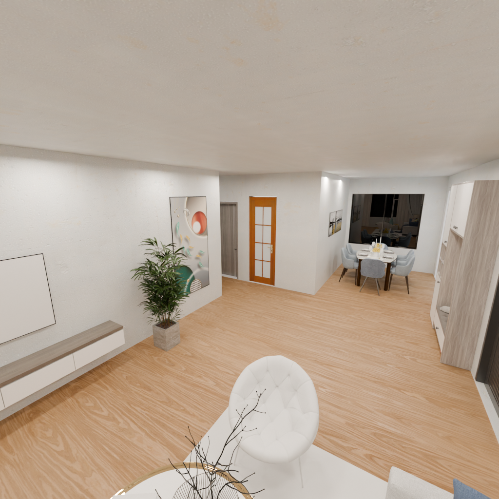

# SceneBuilder

**English** | [中文](README.zh-CN.md)

A repository for **3D scene build**, **render**, **path planning** (for coverage video rendering), and **geometry export** — based on **bpy / pyrender**, from **SSL** structured scene format.

<p align="center">
  
</p>

Build indoor scenes from SSL text (walls, doors, windows, furniture), then render multi-view images, semantic/depth maps, panoramas, export GLB/PLY/voxels, and plan floor paths for auto camera trajectories.

## Roadmap


| Step  | Status         | Goal                                                                                                         |
| ----- | -------------- | ------------------------------------------------------------------------------------------------------------ |
| **1** | ✅ Done         | Render & geometry export toolkit (`render_ssl`, `topdown_view`, `render_view`, GLB/PLY/voxel/semantic/depth) |
| **2** | 🚧 In progress | Release **structured scene data sets**                                                                           |
| **3** | ⏳ Planned      | **Canonical asset retrieve** system                                                                          |
| **4** | ⏳ Planned      | **Asset generation** pipeline integration                                                                    |


## Features

- **Dual backend**: Blender (`bpy`, recommended) or Pyrender (lightweight)
- **Views**: topdown, preset cameras, custom camera, `--views auto` path-driven rendering
- **Exports**: RGB, depth, normals, semantic masks, panorama, visible GLB/PLY, 256³ voxels
- **Path planning**: pixel-aligned topdown + nav-mask floor loop for coverage video
- **Coordinates**: SSL world space + OpenCV camera copies (`ssl_opencv.txt`, `c2w`, `intrinsic`)


## Installation

**Python 3.11** (required for latest `bpy`).

```bash
pip install numpy shapely scipy imageio pyyaml
pip install bpy          # recommended
# or: pip install pyrender trimesh

cd scenebuilder
pip install -e .
```

Headless Pyrender on Linux: set `PYOPENGL_PLATFORM=egl` and install Mesa/EGL libs — see [Full Documentation](docs/doc.en.md#1-installation-and-dependencies).

## Quick Start

### Python — single topdown

```python
from scenebuilder.core.util_data import parse_scene_input
from scenebuilder.core.scenebuilder_bpy import BpySceneCtx

with open("scene.ssl", encoding="utf-8") as f:
    scene = parse_scene_input(f.read())

ctx = BpySceneCtx(scene["room"]["room_type"], asset_dir="path/to/assets")
ctx.add_walls(scene["wall"])
ctx.add_boxes(scene["bbox"])
ctx.normalize_scene_data()
ctx.topdown_view("output", rebuild=True)  # → output/topdown/topdown.png
```


### Python — custom camera

```python
meta = ctx.context["meta"]
center, z_max = meta["center"], meta["z_max"]

ctx.render_view(
    "output",
    camera_position=[center[0], center[1] - meta["span"][1] / 3, z_max * 5 / 6],
    look_at_target=[center[0], center[1], z_max / 2],
    rebuild=True,
)
```

## Advanced — `render_ssl` batch pipeline

For data production and benchmark runs, `render_ssl.py` is the high-level entry point. One invocation can:

- **Normalize** the scene to a pixel-aligned topdown frame and **plan a floor coverage path**
- **Render auto cameras** along that path (`--views auto`), plus preset / custom views
- **Export geometry**: per-view visible GLB / PLY / 256³ voxels, and full-scene holo exports at the output root
- **Export supervision**: semantic masks, metric depth + normals, equirectangular panoramas
- **Resume** interrupted jobs (`--no-resume` to force a full rerun)

Example — turn on the main export switches:

```bash
python render_ssl.py \
  --ssl path/to/ssl.txt \
  --output out \
  --assets path/to/assets \
  --visible_geometry --holo_geometry \
  --glb --ply --voxel \
  --semantic --depth --pano \
  --views auto
```

**Output layout** (`out_normalized/` with `--views auto`):

```
out_normalized/
├── ssl.txt, data.json
├── scene.glb                         # --holo_geometry --glb
├── pointcloud/, voxel/               # --holo_geometry --ply --voxel
├── topdown_normalized/               # pixel-aligned topdown + floor path
├── topdown/                          # regular 1024² topdown + exports
├── auto_views.json
├── auto_path_0000/ …                 # auto single-frame views
├── auto_path_0008_seq/               # auto 3-frame sequences
└── {view}/                           # RGB, depth, semantic, pano, visible glb/ply/voxel …
```

Full directory reference: [§6 Output layout](docs/doc.en.md#6-output-layout-and-coordinate-systems).

Custom cameras are also supported via `--camera_position`, `--look_at`, and optional `--up_vector` (auto-fallback to `[0,1,0]` when the view direction is collinear with default up `[0,0,1]`).

## Documentation

**Full manuals:** [English](docs/doc.en.md) · [中文](docs/doc.zh-CN.md)

Read in this order:

| Step | Topic | English | 中文 |
| ---- | ----- | ------- | ---- |
| 1 | Installation & dependencies | [§1](docs/doc.en.md#1-installation-and-dependencies) | [§1](docs/doc.zh-CN.md#1-安装与依赖) |
| 2 | SSL format & coordinates | [§2](docs/doc.en.md#2-ssl-coordinate-system-and-entities) | [§2](docs/doc.zh-CN.md#2-ssl-坐标系与实体约定) |
| 3 | Quick start & examples | [§3](docs/doc.en.md#3-quick-start) | [§3](docs/doc.zh-CN.md#3-快速开始) |
| 4 | API reference (`topdown_view`, `render_view`, `render_ssl`) | [§4](docs/doc.en.md#4-api-reference) | [§4](docs/doc.zh-CN.md#4-api-参考) |
| 5 | Auto views & floor path (`--views auto`) | [§5](docs/doc.en.md#5-advanced-workflows) | [§5](docs/doc.zh-CN.md#5-高级工作流) |
| 6 | Output layout, `c2w`, exports | [§6](docs/doc.en.md#6-output-layout-and-coordinate-systems) | [§6](docs/doc.zh-CN.md#6-输出目录与坐标系) |
| 7 | Semantic / depth / voxel details | [§7](docs/doc.en.md#7-export-artifacts) | [§7](docs/doc.zh-CN.md#7-导出产物详解) |

## License

This project is licensed under the [MIT License](LICENSE).